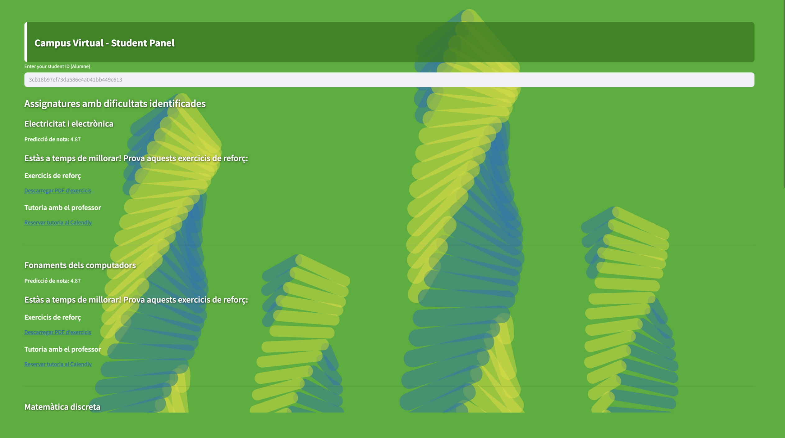

# Synthesis-Project-I: AI mentor program
The goal of this project is to identify students who might be at risk of failing by using past academic data and machine learning. This helps schools to support students early, before problems happen. The project has two main parts: first, giving teachers useful information about their classes and students; second, sending alert messages to students at risk, with activities and exercises to help them succeed.

### Key Features
- Predict students who are at risk of academic failure.
- Send automated alerts to students and professors.
- Web integration.





### How to set up environment and dependencies

#### Using Conda Environment
The environment is defined in the file `synthesis.yml`

To create the environment, run this command on your terminal:
`conda env create -f synthesis.yml`

To activate the environment, use:
`conda activate synthesis`

#### Using pip Requirements

To install the Python packages listed in `requirements.txt`, run:

`pip install -r requirements.txt`

#### Running the Alert Message Code
This project is a Streamlit web app for managing professor-related data and generating Excel files connected to Google Sheets.

Main Apps:
- app_profesors.py 
- app_students.py
To run the app, you first need to install the required Python packages (we recommend creating a conda environment for this project).

`streamlit run app_profesors.py` or `streamlit run app_students.py`

The files/ folder contains all the resources needed for the app to work:
- Exercises
- App background images
- CSV files used to search for information
- Files used to connect Google Sheets with the app

### Folder Structure

Here we provide a partial view of the project structure, highlighting the most relevant files. We've omitted unimportant/generated files for clarity.

```bash
Synthesis-Project-I/
├── Alert_Message/                  # Necessary files for alert message implementation
│   ├── app_profesors.py
│   └── app_students.py
├── Attendance/                     # Attendance datasets converted to CSV files
├── Images/                         # Images of the final web page  
├── Preparing_Data/                 # Data preprocessing scripts and resources
├── Profesors/                      # Professors datasets converted to CSV files
├── Sensors/
│   ├── ClassDataset.py             # Sensor dataset handling code
│   └── CO2.py                   
├── Students/                       # Students datasets converted to CSV files
├── synthesis/
├── DATASET.py                      # Script to generate clean datasets for training dropout and final mark prediction models
├── DropOutModels.ipynb             # Dropout prediction models implementation
├── DropOut_Conclusions.ipynb       # Analysis and conclusions on dropout prediction results
├── EarlyVsLate.ipynb               # Early vs Late fusion models for final mark prediction
├── Ensamble_trees_SUBJECTS.ipynb   # Ensemble trees model focused on a single subject 
├── main.py 
├── Models.ipynb                    # Regression models for predicting students' final marks
├── Student_plots.ipynb             # Data analysis: correlations and feature importance visualization
```

### Authors

- Anna Blanco | NIU:
- Laura Boltà | NIU:
- Sonia Espinilla | NIU:
- Agustina Lazzati | NIU:
- Queralt Salvadó | NIU: 1706789
